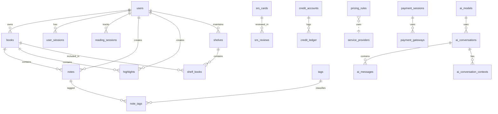

# 04_Database_Schema_and_Migration_Log.md

> **版本**：v1.1 (App-First Sync Revision)
> **来源**：基于 Alembic 迁移脚本反推的当前数据库状态。
> **定位**：数据库设计文档与数据字典。任何 Schema 变更必须先更新 Alembic 脚本，再同步此文档。

## 1. 数据库设计原则

*   **主键**：核心表全部使用 UUID (v4)。
*   **软删除**：核心表（如 `notes`, `tags`, `highlights`, `books`）包含 `deleted_at`（Timestamptz, Nullable）。
*   **审计**：所有表包含 `created_at`，大部分表包含 `updated_at`。
*   **安全**：敏感用户数据表（`notes`, `tags`, `highlights`）启用 RLS (Row Level Security)。
*   **同步协议**：支持 App-First 的表必须包含 `updated_at` (TIMESTAMPTZ/TEXT) 和 `is_deleted` (INTEGER 0/1) 字段以支持增量同步。
*   **扩展性**：广泛使用 `JSONB` 存储动态配置与元数据（如 `books.meta`, `system_settings.value`）。

## 2. 结构总览 (以 Alembic 为准)

以下表格已在生产环境存在：

*   **用户与基础**：`users`, `user_sessions`, `user_stats`, `invites`, `user_reading_goals`, `user_streaks`, `feature_flags`, `system_settings`, `translations`
*   **书籍与内容**：`books`, `shelves`, `shelf_books`, `conversion_jobs`, `tags`
*   **阅读与笔记**：`reading_progress`, `reading_sessions`, `reading_daily`, `notes`, `highlights`, `note_tags`, `highlight_tags`
*   **AI 与 SRS**：`ai_models`, `ai_conversations`, `ai_messages`, `ai_query_cache`, `ai_conversation_contexts`, `srs_cards`, `srs_reviews`
*   **计费与额度**：`credit_accounts`, `credit_ledger`, `credit_products`, `payment_sessions`, `payment_webhook_events`, `payment_gateways`, `pricing_rules`, `regional_prices`, `service_providers`, `free_quota_usage`
*   **其他服务**：`ocr_jobs`, `doc_events`, `doc_snapshots`, `doc_conflicts`, `doc_drafts`, `prompt_templates`

**[待迁移]** 以下表在代码或规划中提及，但尚未在迁移脚本中发现：
*   `vectors` (pgvector 存储表，目前可能使用了 `ai_query_cache` 或尚未创建专用表)

## 3. 客户端数据库 (Client-Side Database: SQLite & PowerSync)

> **Architecture Pivot**: Moved from Dexie.js (IndexedDB) to SQLite (via Capacitor/WASM) for "App-First" architecture. 
> **Sync Engine**: PowerSync (streaming replication).

### 3.1 PowerSync 同步表列表（共 10 个）

> **权威来源**：`web/src/lib/powersync/schema.ts` + `docker/powersync/sync_rules.yaml`
> **最后更新**：2025-12-30

| # | SQLite 表名 | PostgreSQL 源表 | 同步策略 | 说明 |
|---|:-----------|:---------------|:---------|:-----|
| 1 | `books` | `books` | ↕ 双向同步 | 书籍元数据，允许修改 title/author/deleted_at |
| 2 | `reading_progress` | `reading_progress` | ↕ 双向同步 | 阅读进度，LWW 冲突策略 |
| 3 | `reading_sessions` | `reading_sessions` | ↕ 双向同步 | 阅读会话记录 |
| 4 | `notes` | `notes` | ↕ 双向同步 | 用户笔记，Conflict Copy 策略 |
| 5 | `highlights` | `highlights` | ↕ 双向同步 | 高亮标注，Conflict Copy 策略 |
| 6 | `bookmarks` | `bookmarks` | ↕ 双向同步 | 书签 |
| 7 | `shelves` | `shelves` | ↕ 双向同步 | 书架定义 |
| 8 | `shelf_books` | `shelf_books` | ↕ 双向同步 | 书架-书籍关联 |
| 9 | `user_settings` | `user_settings` | ↕ 双向同步 | 用户偏好设置 |
| 10 | `reading_settings` | `reading_settings` | ↕ 双向同步 | **阅读模式设置（每本书独立）** |


> **注意**：阅读统计数据通过前端聚合 `reading_sessions` + `reading_progress` 计算，不作为独立同步表。
> PostgreSQL 有 `reading_daily` 表用于服务端统计，但不同步到客户端。

**本地专用表（不同步）**：
| SQLite 表名 | 说明 |
|:-----------|:-----|
| `local_book_files` | 书籍文件缓存元数据（OPFS/Filesystem 路径） |
| `local_ocr_data` | OCR 结果本地缓存 |
| `local_cover_cache` | 封面图片本地缓存 |

### 3.2 reading_progress 表字段映射对照表 🔑

> **权威来源**：`docker/powersync/sync_rules.yaml` + `web/src/lib/powersync/schema.ts`
> **最后更新**：2025-12-17

| SQLite (前端) | PostgreSQL (后端) | 类型 | 前端使用说明 |
|:-------------|:-----------------|:-----|:------------|
| `id` | `id` | UUID | 主键 |
| `user_id` | `user_id` | UUID | 用户 ID |
| `book_id` | `book_id` | UUID | 书籍 ID |
| `device_id` | `device_id` | TEXT | 设备 ID |
| `progress` | `progress` | REAL (0-1) | 阅读进度百分比，前端代码中映射为 `percentage` |
| `last_position` | `last_position` | TEXT | CFI 位置字符串，前端代码中映射为 `currentCfi` |
| `last_location` | `last_location` | TEXT (JSON) | `{ currentPage, totalPages }` |
| `finished_at` | `finished_at` | TEXT (ISO8601) | 读完时间 |
| `updated_at` | `updated_at` | TEXT (ISO8601) | 最后更新时间，前端代码中映射为 `lastReadAt` |

> ⚠️ **重要**：前端代码（如 `useProgressData.ts`）在业务层使用语义化字段名（如 `percentage`, `currentCfi`），
> 但在 SQL 查询中必须使用 PowerSync Schema 定义的字段名（如 `progress`, `last_position`）。

### 3.3 reading_sessions 表字段映射对照表

> **权威来源**：`docker/powersync/sync_rules.yaml` + `web/src/lib/powersync/schema.ts`

| SQLite (前端) | PostgreSQL (后端) | 类型 | 说明 |
|:-------------|:-----------------|:-----|:-----|
| `id` | `id` | UUID | 主键 |
| `user_id` | `user_id` | UUID | 用户 ID |
| `book_id` | `book_id` | UUID | 书籍 ID |
| `device_id` | `device_id` | TEXT | 设备 ID |
| `is_active` | `is_active` | INTEGER (0/1) | 会话是否活跃 |
| `total_ms` | `total_ms` | INTEGER | 阅读时长（毫秒），注意：是毫秒不是秒！ |
| `created_at` | `created_at` | TEXT (ISO8601) | 会话开始时间 |
| `updated_at` | `updated_at` | TEXT (ISO8601) | 最后心跳时间 |

> ⚠️ **注意**：`total_ms` 是毫秒单位，显示分钟需要 `/60000`。

### 3.4 books 表字段映射对照表 🔑

> **⚠️ 关键说明**：PostgreSQL 使用 `is_digitalized` 存储（语义：是否数字化/可搜索），  
> 通过 sync_rules.yaml 映射为 SQLite 的 `is_image_based`（语义：是否图片型/需OCR）。  
> **两者语义相反！** 映射公式：`is_image_based = NOT is_digitalized OR confidence < 0.8`

| SQLite (前端) | PostgreSQL (后端) | sync_rules 映射 | 类型 | 说明 |
|:-------------|:-----------------|:----------------|:-----|:-----|
| `id` | `id` | 直接映射 | UUID | 主键 |
| `user_id` | `user_id` | 直接映射 | UUID | 所属用户 |
| `title` | `title` | 直接映射 | TEXT | 书名 |
| `author` | `author` | 直接映射 | TEXT | 作者 |
| `cover_url` | `cover_image_key` | `AS cover_url` | TEXT | 封面 S3 Key |
| `file_type` | `original_format` | `AS file_type` | TEXT | 原始格式 |
| `file_size` | `size` | `AS file_size` | INTEGER | 文件大小 (bytes) |
| `content_sha256` | `content_sha256` | 直接映射 | TEXT | 文件哈希 |
| `storage_key` | `minio_key` | `AS storage_key` | TEXT | MinIO 存储 Key |
| `metadata_confirmed` | `metadata_confirmed` | 直接映射 | INTEGER (0/1) | 元数据已确认 |
| `is_image_based` | `is_digitalized` | **⚠️ 语义转换** | INTEGER (0/1) | 见下方计算公式 |
| `ocr_status` | `ocr_status` | 直接映射 | TEXT | OCR 处理状态 |
| `conversion_status` | `conversion_status` | 直接映射 | TEXT | 格式转换状态 |
| `converted_epub_key` | `converted_epub_key` | 直接映射 | TEXT | 转换后 EPUB Key |
| `page_count` | `meta->>'page_count'` | **提取 JSONB** | INTEGER | 书籍页数 |
| `created_at` | `created_at` | 直接映射 | TEXT (ISO8601) | 创建时间 |
| `updated_at` | `updated_at` | 直接映射 | TEXT (ISO8601) | 更新时间 |
| `deleted_at` | `deleted_at` | 直接映射 | TEXT (ISO8601) | 软删除时间 |

**`is_image_based` 计算公式（sync_rules.yaml）**：
```sql
-- 在 sync_rules.yaml 中计算
(CASE 
  WHEN is_digitalized = false THEN 1        -- 明确的图片型
  WHEN is_digitalized = true AND initial_digitalization_confidence < 0.8 THEN 1  -- 低置信度
  ELSE 0                                      -- 文字型
END) as is_image_based
```

**PostgreSQL 独有字段（不同步到 SQLite）**：
| 字段 | 用途 | 不同步原因 |
|:-----|:-----|:----------|
| `canonical_book_id` | SHA256 去重引用 | 后端内部逻辑 |
| `storage_ref_count` | 存储引用计数 | 后端内部逻辑 |
| `source_etag` | 上传幂等性 | 后端内部逻辑 |
| `digitalize_report_key` | 数字化报告 Key | 后端内部逻辑 |
| `ocr_result_key` | OCR 结果 Key | 后端内部逻辑 |
| `ocr_requested_at` | OCR 请求时间 | 后端内部逻辑 |
| `vector_indexed_at` | 向量索引时间 | 后端内部逻辑 |
| `language` | 书籍语言 | 考虑未来同步 |

### 3.3 PowerSync 认证与权限

> **认证说明**：PowerSync Service 在建立连接时通过 JWT 解析出 `user_id`，并在 Sync Rules 中使用参数化查询 `WHERE user_id = bucket.user_id`（而非 PostgreSQL 的 `current_setting()`）。

**写入权限矩阵**：
| 表 | PowerSync 可写 | 限制说明 |
|:---|:--------------|:---------|
| `books` | ⚠️ 部分可写 | 仅能 UPDATE `metadata_confirmed`, `deleted_at`, `title`, `author` |
| `reading_progress` | ✅ INSERT/UPDATE | LWW 策略，`updated_at` 比较 |
| `reading_sessions` | ✅ INSERT/UPDATE | 会话心跳更新 |
| `notes` | ✅ CRUD | Conflict Copy 策略 |
| `highlights` | ✅ CRUD | Conflict Copy 策略 |
| `bookmarks` | ✅ CRUD | 无冲突处理 |
| `shelves` | ✅ CRUD | 字段级合并 |
| `shelf_books` | ✅ CRUD | 需要 `user_id` 字段 |
| `user_settings` | ✅ UPSERT | JSONB 合并策略 |

> **权威来源**：`docker/powersync/sync_rules.yaml`

---

## 4. 实体关系图 (ERD)



## 5. 数据字典 (Data Dictionary)

### 3.1 用户与认证 (User & Auth)

#### `users`
用户核心表。
*   `id` (UUID, PK)
*   `email` (TEXT, Unique, Lowercase)
*   `display_name` (TEXT)
*   `is_active` (BOOLEAN, Default: TRUE)
*   `membership_tier` (TEXT, Default: 'FREE')
*   `language` (TEXT, Default: 'zh-CN')
*   `timezone` (TEXT, Default: 'Asia/Shanghai')
*   `membership_expire_at` (TIMESTAMPTZ, Nullable)
*   `monthly_gift_reset_at` (TIMESTAMPTZ, Nullable)
*   `free_ocr_usage` (INTEGER, Default: 0)
*   `version` (INTEGER, Default: 1)
*   `updated_at` (TIMESTAMPTZ)

#### `user_sessions`
用户登录会话。
*   `id` (UUID, PK)
*   `user_id` (UUID, FK `users.id`)
*   `revoked` (BOOLEAN, Default: FALSE)
*   `created_at` (TIMESTAMPTZ)

#### `user_stats`
用户统计聚合表。
*   **Source**: Created in Migration `0111` (f1a2b3c4d5e6).
*   `user_id` (UUID, PK)
*   `invite_count` (INTEGER, Default: 0)
*   `extra_storage_quota` (BIGINT, Default: 0)
*   `extra_book_quota` (INTEGER, Default: 0)
*   `storage_used` (BIGINT, Default: 0)
*   `book_count` (INTEGER, Default: 0)
*   `updated_at` (TIMESTAMPTZ)

#### `invites`
邀请记录。
*   `id` (UUID, PK)
*   `inviter_id` (UUID)
*   `invite_code` (VARCHAR(20))
*   `status` (VARCHAR(20), Default: 'pending')
*   `invitee_id` (UUID, Nullable)
*   `completed_at` (TIMESTAMPTZ, Nullable)
*   `created_at` (TIMESTAMPTZ)

### 3.2 书籍与资产 (Books & Assets)

#### `books`
核心书籍表。
*   `id` (UUID, PK)
*   `user_id` (UUID)
*   `title` (TEXT)
*   `author` (TEXT, Nullable)
*   `language` (TEXT, Nullable)
*   `original_format` (TEXT, Nullable)
*   `minio_key` (TEXT)
*   `size` (BIGINT, Nullable)
*   `cover_image_key` (TEXT, Nullable)
*   `source_etag` (TEXT, Nullable)
*   `is_digitalized` (BOOLEAN, Nullable) - `true`=文字型, `false`=图片型, `null`=未检测
*   `initial_digitalization_confidence` (NUMERIC, Nullable)
*   `converted_epub_key` (TEXT, Nullable)
*   `digitalize_report_key` (TEXT, Nullable)
*   `ocr_status` (VARCHAR(20), Nullable) - OCR 处理状态，枚举值见下表
*   `ocr_requested_at` (TIMESTAMPTZ, Nullable) - 用户请求 OCR 的时间
*   `ocr_result_key` (TEXT, Nullable) - OCR 结果 JSON 文件的 S3 Key
*   `vector_indexed_at` (TIMESTAMPTZ, Nullable) - 向量索引完成时间
*   `metadata_confirmed` (BOOLEAN, Default: FALSE) - 用户是否已确认元数据
*   `metadata_confirmed_at` (TIMESTAMPTZ, Nullable) - 元数据确认时间
*   `content_sha256` (VARCHAR(64), Nullable) - **文件内容 SHA256 哈希**，用于全局去重
*   `storage_ref_count` (INTEGER, Default: 1) - **存储引用计数**，表示有多少书籍共享此存储
*   `canonical_book_id` (UUID, Nullable, FK `books.id`) - **去重引用指向的原始书籍 ID**
*   `deleted_at` (TIMESTAMPTZ, Nullable) - **软删除时间戳**
*   `meta` (JSONB, Default: '{}')
    *   `page_count` (int): 书籍页数
    *   `needs_manual` (bool): 是否需要人工介入
    *   `toc` (list): 目录结构 (Confirmed by usage)
        *   Schema: `[{ "title": "Chapter 1", "href": "ch1.html", "children": [...] }]`
    *   `cover_color` (string): 封面主色调 (Confirmed by usage)
    *   `is_scanned` (bool): 是否为扫描版 (Confirmed by usage)
    *   `dpi` (int): 扫描分辨率 (Confirmed by usage)
    *   `reflow_profile` (string): 重排参数 (Confirmed by usage)
    *   **Note**: 元数据字段 schema 未来将迁移到 OpenAPI 契约统一维护。
*   `version` (INTEGER, Default: 1)
*   `created_at` (TIMESTAMPTZ)
*   `updated_at` (TIMESTAMPTZ)

**索引**：
- `idx_books_content_sha256` (部分索引): `WHERE content_sha256 IS NOT NULL`
- `idx_books_canonical_book_id`: 用于查询引用书籍

**`ocr_status` 枚举值**：
| 值 | 说明 |
|---|---|
| `NULL` | 文字型书籍，无需 OCR |
| `pending` | 用户已请求 OCR，等待排队 |
| `processing` | OCR 正在处理中 |
| `completed` | OCR 处理完成 |
| `failed` | OCR 处理失败 |

> **元数据确认说明**：
> - `metadata_confirmed = false`：用户尚未确认元数据，上传后应弹出确认对话框
> - `metadata_confirmed = true`：用户已确认（或跳过），不再提示
> - `title` 和 `author` 字段会作为 AI 对话上下文发送给上游模型

> **SHA256 去重机制说明**：
> - `content_sha256`: 用于全局去重判断，相同哈希表示相同文件内容
> - `storage_ref_count`: 初始值为 1（代表原书自己），秒传引用时 +1，引用书删除时 -1
> - `canonical_book_id`: 非空时表示这是一个去重引用书，指向原始书籍
> - 原书判断：`canonical_book_id IS NULL`
> - 引用书判断：`canonical_book_id IS NOT NULL`

> **is_image_based 判断逻辑**（前端用于显示 OCR 按钮）：
> ```python
> is_image_based = (
>     (is_digitalized == True AND confidence < 0.8)  # 图片型 PDF
>     OR ocr_status == 'completed'  # 已完成 OCR 的书籍
> )
> ```

#### 书籍删除策略（Soft Delete & Hard Delete）

书籍删除采用**分层策略**，区分私人数据和公共数据：

| 场景 | 删除类型 | 行为 |
|-----|---------|------|
| 原书有引用 (`ref_count > 1`) | 软删除 | 设置 `deleted_at`，保留公共数据 |
| 原书无引用 (`ref_count <= 1`) | 硬删除 | 物理删除所有数据 |
| 引用书删除 | 硬删除 | 删除记录，减少原书 `ref_count`，检查原书是否需清理 |

**公共数据 vs 私人数据**：
| 数据类型 | 所有者 | 软删除时 | 硬删除时 |
|---------|-------|---------|---------|
| S3 文件 (PDF/EPUB) | 共享 | 保留 | 删除 |
| 封面图片 | 共享 | 保留 | 删除 |
| OCR 结果 JSON | 共享 | 保留 | 删除 |
| 向量索引 (OpenSearch) | 共享 | 保留 | 删除 |
| 笔记/高亮 | 用户私有 | 立即删除 | 立即删除 |
| 阅读进度 | 用户私有 | 立即删除 | 立即删除 |
| 书架关联 | 用户私有 | 立即删除 | 立即删除 |

**删除流程伪代码**：
```python
def delete_book(book_id, user_id):
    book = get_book(book_id)
    
    # 1. 始终删除用户私有数据
    delete_notes(book_id, user_id)
    delete_highlights(book_id, user_id)
    delete_reading_progress(book_id, user_id)
    delete_shelf_books(book_id)
    
    # 2. 判断是引用书还是原书
    if book.canonical_book_id:
        # 引用书：直接删除，减少原书引用计数
        canonical = get_book(book.canonical_book_id)
        canonical.storage_ref_count -= 1
        delete_book_record(book_id)  # 物理删除
        
        # 检查原书是否需要清理
        if canonical.deleted_at and canonical.storage_ref_count <= 1:
            hard_delete_canonical(canonical)
    else:
        # 原书：检查引用计数
        has_references = book.storage_ref_count > 1
        
        if has_references:
            # 软删除：保留公共数据
            book.deleted_at = now()
        else:
            # 硬删除：清理所有公共数据
            delete_s3_file(book.minio_key)
            delete_s3_file(book.cover_image_key)
            delete_s3_file(book.ocr_result_key)
            delete_search_index(book_id)
            delete_book_record(book_id)
```

#### `shelves`
书架。
*   `id` (UUID, PK)
*   `user_id` (UUID)
*   `name` (TEXT)
*   `description` (TEXT, Nullable)
*   `version` (INTEGER, Default: 1)
*   `created_at` (TIMESTAMPTZ)
*   `updated_at` (TIMESTAMPTZ)

#### `shelf_books`
书架-书籍关联。
*   `id` (UUID, PK)
*   `shelf_id` (UUID)
*   `book_id` (UUID)
*   `user_id` (UUID) - 冗余存储，用于 PowerSync 同步过滤
*   `sort_order` (INTEGER, Nullable)
*   `added_at` (TIMESTAMPTZ)
*   约束：UNIQUE (shelf_id, book_id)

#### `conversion_jobs`
书籍格式转换任务。
*   `id` (UUID, PK)
*   `user_id` (UUID) - (**Verified**: Defined as `user_id` in Alembic `0100`. If app code uses `owner_id`, it requires refactoring.)
*   `book_id` (UUID)
*   `source_key` (TEXT)
*   `target_format` (TEXT)
*   `output_key` (TEXT, Nullable)
*   `status` (TEXT, Default: 'pending')
*   `error` (TEXT, Nullable)
*   `created_at` (TIMESTAMPTZ)
*   `updated_at` (TIMESTAMPTZ)

### 3.3 笔记与高亮 (Notes & Highlights)

#### `notes`
用户笔记 (启用 RLS)。
*   `id` (UUID, PK)
*   `user_id` (UUID)
*   `book_id` (UUID)
*   `content` (TEXT)
*   `chapter` (TEXT, Nullable)
*   `location` (TEXT, Nullable)
*   `pos_offset` (INTEGER, Nullable)
*   `tsv` (TSVECTOR, Nullable) - 用于 Postgres 内置全文检索，当 OpenSearch 不可用时作为 fallback。
*   `version` (INTEGER, Default: 1)
*   `device_id` (VARCHAR(64), Nullable) - **[待迁移]** 创建该笔记的设备 ID，用于冲突检测
*   `conflict_of` (UUID, Nullable, FK `notes.id`) - **[待迁移]** 如果是冲突副本，指向原始笔记
*   `deleted_at` (TIMESTAMPTZ, Nullable)
*   `created_at` (TIMESTAMPTZ)
*   `updated_at` (TIMESTAMPTZ)

> **冲突副本说明**：当多设备同时修改同一笔记时，不采用静默覆盖（LWW），而是创建冲突副本。
> - `conflict_of` 指向原始笔记 ID
> - 前端在笔记列表显示冲突标记，用户可手动合并
> - 合并后删除冲突副本

#### `highlights`
高亮 (启用 RLS)。
*   `id` (UUID, PK)
*   `user_id` (UUID)
*   `book_id` (UUID)
*   `start_location` (TEXT)
*   `end_location` (TEXT)
*   `color` (TEXT, Nullable)
*   `comment` (TEXT, Nullable)
*   `tsv` (TSVECTOR, Nullable) - 用于 Postgres 内置全文检索，当 OpenSearch 不可用时作为 fallback。
*   `version` (INTEGER, Default: 1)
*   `device_id` (VARCHAR(64), Nullable) - **[待迁移]** 创建该高亮的设备 ID
*   `conflict_of` (UUID, Nullable, FK `highlights.id`) - **[待迁移]** 如果是冲突副本，指向原始高亮
*   `deleted_at` (TIMESTAMPTZ, Nullable)
*   `created_at` (TIMESTAMPTZ)
*   `updated_at` (TIMESTAMPTZ)

#### `tags`
标签系统 (启用 RLS)。
*   `id` (UUID, PK)
*   `user_id` (UUID)
*   `name` (TEXT)
*   `version` (INTEGER, Default: 1)
*   `deleted_at` (TIMESTAMPTZ, Nullable)
*   `created_at` (TIMESTAMPTZ)
*   `updated_at` (TIMESTAMPTZ)

#### `note_tags`
笔记-标签关联表 (Many-to-Many)。
*   `note_id` (UUID, PK, FK `notes.id`)
*   `tag_id` (UUID, PK, FK `tags.id`)
*   **Note**: 迁移脚本 `0106` 中尚未包含 `created_at`，建议在后续版本补充。

#### `highlight_tags`
高亮-标签关联表 (Many-to-Many)。
*   `highlight_id` (UUID, PK, FK `highlights.id`)
*   `tag_id` (UUID, PK, FK `tags.id`)
*   **Note**: 迁移脚本 `0106` 中尚未包含 `created_at`，建议在后续版本补充。

### 3.4 阅读进度 (Reading Progress)

#### `reading_sessions`
阅读会话记录。
*   `id` (UUID, PK)
*   `user_id` (UUID, FK)
*   `book_id` (UUID)
*   `device_id` (TEXT, Nullable)
*   `is_active` (BOOLEAN, Default: TRUE)
*   `total_ms` (BIGINT, Default: 0)
*   `last_heartbeat` (TIMESTAMPTZ, Default: now())

#### `reading_daily`
每日阅读统计。
*   `user_id` (UUID, PK)
*   `day` (DATE, PK)
*   `total_ms` (BIGINT, Default: 0)

#### `user_streaks`
用户阅读连续天数统计。
*   `user_id` (UUID, PK, FK `users.id`)
*   `current_streak` (INTEGER, Default: 0)
*   `longest_streak` (INTEGER, Default: 0)
*   `last_read_date` (DATE, Nullable)
*   `updated_at` (TIMESTAMPTZ)

#### `reading_progress`
每本书的阅读状态。
*   `user_id` (UUID, PK)
*   `book_id` (UUID, PK)
*   `progress` (NUMERIC, Default: 0)
*   `last_location` (JSONB, Nullable)
    *   (Schema 待定，通常包含 CFI 或页码信息)
*   `finished_at` (TIMESTAMPTZ, Nullable)
*   `updated_at` (TIMESTAMPTZ)

#### `user_reading_goals`
用户阅读目标。
*   `user_id` (UUID, PK, FK `users.id`)
*   `daily_minutes` (INTEGER, Default: 30)
*   `yearly_books` (INTEGER, Default: 10)
*   `updated_at` (TIMESTAMPTZ)

### 3.5 阅读模式设置 (Reading Settings) 🆕

> **用途**：支持每本书独立的阅读外观设置，可跨设备同步
> **添加版本**：2025-12-30

#### `reading_settings`
阅读模式设置表（启用 RLS，支持 PowerSync 双向同步）。

**表结构**：
*   `id` (UUID, PK)
*   `user_id` (UUID, FK `users.id`) - 用户 ID
*   `book_id` (UUID, FK `books.id`, Nullable) - **NULL 表示全局默认设置**
*   `device_id` (TEXT, Nullable) - 创建/修改设备 ID

**主题设置**：
*   `theme_id` (TEXT, Default: 'white') - 预设主题 ID: `white`|`sepia`|`toffee`|`gray`|`dark`|`black`|`custom`
*   `background_color` (TEXT, Nullable) - 自定义背景色 `#RRGGBB`
*   `text_color` (TEXT, Nullable) - 自定义文字色 `#RRGGBB`

**文字设置**：
*   `font_family` (TEXT, Default: 'system') - 字体名称
*   `font_size` (INTEGER, Default: 18) - 字号 (范围: 12-32)
*   `font_weight` (INTEGER, Default: 400) - 字重 (400/500/600/700)

**间距设置**：
*   `line_height` (REAL, Default: 1.6) - 行高倍数 (范围: 1.0-2.5)
*   `paragraph_spacing` (REAL, Default: 1.0) - 段间距倍数
*   `margin_horizontal` (INTEGER, Default: 24) - 水平边距 (px)

**显示设置**：
*   `text_align` (TEXT, Default: 'justify') - 对齐方式: `left`|`justify`
*   `hyphenation` (BOOLEAN, Default: TRUE) - 自动断字

**元数据**：
*   `is_deleted` (INTEGER, Default: 0) - 软删除标记
*   `deleted_at` (TIMESTAMPTZ, Nullable) - 软删除时间
*   `created_at` (TIMESTAMPTZ)
*   `updated_at` (TIMESTAMPTZ)

**约束**：
*   `UNIQUE (user_id, book_id)` - 每个用户每本书只有一条设置记录
*   当 `book_id IS NULL` 时表示**全局默认设置**

**索引**：
*   `idx_reading_settings_user_id` ON `reading_settings(user_id)`
*   `idx_reading_settings_user_book` ON `reading_settings(user_id, book_id)`

**PowerSync 同步策略**：
*   下载：`WHERE user_id = bucket.user_id`
*   上传：完整 UPSERT，使用 `updated_at` LWW 策略

**预设主题值**：
| theme_id | 名称 | background_color | text_color |
|----------|------|------------------|------------|
| `white` | 白色 | #FFFFFF | #1D1D1F |
| `sepia` | 奶白 | #F4ECD8 | #3D3D3D |
| `toffee` | 太妃糖 | #E8D5B5 | #4A4A4A |
| `gray` | 灰色 | #E8E8E8 | #2D2D2D |
| `dark` | 深色 | #1C1C1E | #FFFFFF |
| `black` | 纯黑 | #000000 | #FFFFFF |
| `custom` | 自定义 | (用户选择) | (用户选择) |

**预设字体值**：
| font_family | 显示名称 | 类型 |
|-------------|----------|------|
| `system` | 系统默认 | 系统 |
| `noto-serif-sc` | 思源宋体 | 中文衬线 |
| `noto-sans-sc` | 思源黑体 | 中文无衬线 |
| `lxgw-wenkai` | 霞鹜文楷 | 中文楷体 |
| `georgia` | Georgia | 英文衬线 |
| `helvetica` | Helvetica | 英文无衬线 |

### 3.6 商业与计费 (Billing)

#### `credit_accounts`
用户积分账户。
*   `owner_id` (UUID, PK)
*   `balance` (BIGINT, Default: 0)
*   `currency` (TEXT, Nullable)
*   `wallet_amount` (NUMERIC, Default: 0)
*   `wallet_currency` (TEXT, Default: 'CNY')
*   `updated_at` (TIMESTAMPTZ)

#### `credit_ledger`
积分流水账。
*   `id` (UUID, PK)
*   `owner_id` (UUID)
*   `amount` (BIGINT)
*   `currency` (TEXT)
*   `reason` (TEXT, Nullable)
*   `related_id` (UUID, Nullable)
*   `direction` (TEXT)
*   `created_at` (TIMESTAMPTZ)

#### `credit_products`
积分充值商品。
*   `id` (UUID, PK)
*   `code` (TEXT, Unique)
*   `name` (TEXT)
*   `credits` (INTEGER)
*   `amount_minor` (INTEGER)
*   `currency` (TEXT, Default: 'CNY')
*   `updated_at` (TIMESTAMPTZ)

#### `payment_sessions`
支付会话。
*   `id` (UUID, PK)
*   `owner_id` (UUID)
*   `gateway` (TEXT)
*   `amount` (INTEGER)
*   `currency` (TEXT)
*   `status` (TEXT, Default: 'pending')
*   `return_url` (TEXT, Nullable)
*   `cancel_url` (TEXT, Nullable)
*   `external_id` (TEXT, Nullable)
*   `metadata` (JSONB, Nullable)
*   `created_at` (TIMESTAMPTZ)
*   `updated_at` (TIMESTAMPTZ)

#### `payment_webhook_events`
支付回调事件记录。
*   `id` (TEXT, PK)
*   `gateway` (TEXT)
*   `session_id` (UUID, Nullable)
*   `payload` (JSONB, Nullable)
*   `processed` (BOOLEAN, Default: FALSE)
*   `created_at` (TIMESTAMPTZ)
*   `updated_at` (TIMESTAMPTZ)

#### `payment_gateways`
支付网关配置。
*   `id` (UUID, PK)
*   `name` (TEXT, Unique)
*   `config` (JSONB)
*   `is_active` (BOOLEAN, Default: TRUE)
*   `version` (INTEGER, Default: 1)
*   `created_at` (TIMESTAMPTZ)
*   `updated_at` (TIMESTAMPTZ)

#### `pricing_rules`
定价规则。
*   `id` (UUID, PK)
*   `service_type` (VARCHAR(32))
*   `unit_type` (VARCHAR(32))
*   `unit_size` (INTEGER)
*   `price_amount` (NUMERIC(10,2))
*   `currency` (VARCHAR(10))
*   `region` (VARCHAR(10), Nullable)
*   `remark_template` (TEXT, Nullable)
*   `platform` (VARCHAR(20), Default: 'web')
*   `sku_id` (VARCHAR(100), Nullable)
*   `is_active` (BOOLEAN)
*   `version` (INTEGER)
*   `created_at` (TIMESTAMPTZ)
*   `updated_at` (TIMESTAMPTZ)

#### `regional_prices`
区域定价策略。
*   `id` (UUID, PK)
*   `plan_code` (VARCHAR(50))
*   `currency` (VARCHAR(10))
*   `period` (VARCHAR(20))
*   `amount_minor` (INTEGER)
*   `updated_at` (TIMESTAMPTZ)
*   `version` (INTEGER, Default: 1)

#### `service_providers`
第三方服务商配置。
*   `id` (UUID, PK)
*   `service_type` (TEXT)
*   `name` (TEXT)
*   `endpoint` (TEXT, Nullable)
*   `config` (JSONB, Default: '{}')
*   `is_active` (BOOLEAN, Default: TRUE)
*   `priority` (INTEGER, Default: 0)
*   `version` (INTEGER, Default: 1)
*   `updated_at` (TIMESTAMPTZ)

#### `free_quota_usage`
免费额度使用记录。
*   `owner_id` (UUID, PK)
*   `service_type` (TEXT, PK)
*   `period_start` (DATE, PK)
*   `used_units` (BIGINT, Default: 0)

### 3.6 AI 与向量 (AI & Vectors)

#### `ai_models`
AI 模型配置。
*   `id` (UUID, PK)
*   `provider` (TEXT)
*   `model_id` (TEXT, Unique)
*   `display_name` (TEXT)
*   `active` (BOOLEAN, Default: TRUE)
*   `updated_at` (TIMESTAMPTZ)

#### `ai_conversations`
AI 对话 Session。
*   `id` (UUID, PK)
*   `owner_id` (UUID)
*   `title` (TEXT)
*   `created_at` (TIMESTAMPTZ)

#### `ai_messages`
对话消息记录。
*   `id` (UUID, PK)
*   `conversation_id` (UUID, FK `ai_conversations.id`)
*   `owner_id` (UUID)
*   `role` (TEXT)
*   `content` (TEXT)
*   `created_at` (TIMESTAMPTZ)

#### `ai_conversation_contexts`
对话上下文关联。
*   `conversation_id` (UUID, PK, FK `ai_conversations.id`)
*   `owner_id` (UUID)
*   `mode` (TEXT, Nullable)
*   `book_ids` (JSONB, Nullable)
    *   Array of UUID strings: `["uuid1", "uuid2"]`
*   `updated_at` (TIMESTAMPTZ)

#### `ai_query_cache`
AI 响应缓存。
*   `owner_id` (UUID, PK)
*   `conversation_id` (UUID, Nullable)
*   `query_hash` (TEXT, PK)
*   `prompt` (TEXT, Nullable)
*   `response` (TEXT, Nullable)
*   `updated_at` (TIMESTAMPTZ)

#### `srs_cards`
间隔复习卡片。
*   `id` (UUID, PK)
*   `owner_id` (UUID)
*   `highlight_id` (UUID, Unique)
*   `question` (TEXT)
*   `answer` (TEXT)
*   `created_at` (TIMESTAMPTZ)
*   `updated_at` (TIMESTAMPTZ)

#### `srs_reviews`
复习记录。
*   `id` (UUID, PK)
*   `owner_id` (UUID)
*   `card_id` (UUID, FK `srs_cards.id`)
*   `ease_factor` (NUMERIC, Default: 2.5)
*   `repetitions` (INTEGER, Default: 0)
*   `interval_days` (INTEGER, Default: 1)
*   `last_grade` (INTEGER, Nullable)
*   `next_review_at` (TIMESTAMPTZ, Nullable)
*   `updated_at` (TIMESTAMPTZ)

#### `vectors` (Future Plan / Not Implemented)
*   **Status**: [待迁移]
*   **Description**: 计划引入的 pgvector 向量索引表，用于替代 `ai_query_cache` 的部分功能并支持全文向量检索。
*   **Note**: 当前系统可能使用 `ai_query_cache` 或内存向量库，此表尚未实装。
*   **Proposed Schema**: `embedding_id`, `owner_id`, `content_type`, `content_id`, `embedding vector(1536)`.

### 3.7 文档协作 (Realtime Docs)

#### `doc_events`
文档编辑事件日志。
*   `id` (UUID, PK)
*   `doc_id` (TEXT)
*   `content` (TEXT)
*   `created_at` (TIMESTAMPTZ)
*   **Note**: 当前实现仅为基础日志。未来版本计划增加 `version` (int), `actor_id` (uuid), `ops` (jsonb), `is_conflict` (bool) 以支持完整 CRDT/OT 协作。

#### `doc_snapshots`
文档快照。
*   `id` (UUID, PK)
*   `doc_id` (TEXT)
*   `snapshot` (TEXT)
*   `created_at` (TIMESTAMPTZ)

#### `doc_conflicts`
编辑冲突记录。
*   `id` (UUID, PK)
*   `doc_id` (TEXT)
*   `base_version` (INTEGER)
*   `actual_version` (INTEGER)
*   `created_at` (TIMESTAMPTZ)

#### `doc_drafts`
文档草稿。
*   `id` (UUID, PK)
*   `doc_id` (TEXT)
*   `snapshot` (TEXT)
*   `created_at` (TIMESTAMPTZ)

### 3.8 其他服务与系统 (Other Services & System)

#### `ocr_jobs`
OCR 识别任务。
*   `id` (UUID, PK)
*   `user_id` (UUID) - (Added in 0109)
*   `owner_id` (UUID) - (Legacy field from 0100)
*   `book_id` (UUID, Nullable) - (Added in 0109)
*   `source_key` (TEXT)
*   `status` (TEXT, Default: 'uploading')
*   `result_text` (TEXT, Nullable)
*   `error` (TEXT, Nullable)
*   `page_count` (INTEGER, Default: 0) - (Added in 0109)
*   `deduction_strategy` (VARCHAR(50), Nullable) - (Added in 0109)
*   `deduction_amount` (INTEGER, Default: 0) - (Added in 0109)
*   `created_at` (TIMESTAMPTZ)
*   `updated_at` (TIMESTAMPTZ)

#### `prompt_templates`
AI 提示词模板。
*   `id` (UUID, PK)
*   `name` (TEXT, Unique)
*   `content` (TEXT)
*   `updated_at` (TIMESTAMPTZ)
*   **Note**: 迁移脚本 `0103` 中尚未包含 `variables`, `version`, `description`，建议在后续版本补充。

#### `system_settings`
系统全局配置。
*   `id` (UUID, PK)
*   `key` (TEXT, Unique)
*   `value` (JSONB)
*   `updated_at` (TIMESTAMPTZ)

#### `feature_flags`
功能特性开关。
*   `id` (UUID, PK)
*   `key` (TEXT, Unique)
*   `is_enabled` (BOOLEAN, Default: FALSE)
*   `updated_at` (TIMESTAMPTZ)

#### `translations`
多语言翻译资源。
*   `id` (UUID, PK)
*   `namespace` (TEXT)
*   `key` (TEXT)
*   `lang` (TEXT)
*   `value` (JSONB)
*   `deleted_at` (TIMESTAMPTZ, Nullable)
*   `version` (INTEGER, Default: 1)
*   `updated_at` (TIMESTAMPTZ)
*   Constraint: `UNIQUE(namespace, key, lang)`

## 6. RLS 策略详解 (Row Level Security)

当前仅以下表启用了 RLS，策略均为 **Owner Isolation**：

1.  **Notes** (`notes`)
2.  **Tags** (`tags`)
3.  **Highlights** (`highlights`)

**策略逻辑**：
```sql
USING (
  user_id = current_setting('app.user_id')::uuid 
  OR current_setting('app.role', true) = 'admin'
)
WITH CHECK (
  user_id = current_setting('app.user_id')::uuid 
  OR current_setting('app.role', true) = 'admin'
)
```
*   **读取/修改**：仅允许 `user_id` 匹配当前 Session 变量 `app.user_id` 的行。
*   **例外**：如果 Session 变量 `app.role` 为 `admin`，则拥有完全访问权限。
*   **依赖**：应用层必须在连接 PgBouncer 后、执行查询前，执行 `SET app.user_id = '...'`。
*   **警告**：必须确保在 PgBouncer (transaction pooling) 环境下，通过 `SET LOCAL app.user_id` 完成用户隔离。禁止匿名访问，否则 query 会被错误共享，造成严重越权问题。

**未来扩展计划**：
*   **书籍共享模式**：计划引入 `book_shares` 表，支持多用户对同一书籍的只读或协作权限。届时 RLS 策略需升级为 `user_id = current_user OR EXISTS (SELECT 1 FROM book_shares WHERE book_id = ...)`。
*   **团队/组织隔离**：引入 `organization_id`，支持 B 端租户隔离。

## 7. 索引优化 (Indexes)

核心业务索引（自动创建）：

*   **唯一性约束**：
    *   `books(user_id, source_etag)` -> `uniq_books_user_etag`
    *   `tags(user_id, name)` (Partial: `WHERE deleted_at IS NULL`) -> `uniq_tags_user_name_active`
    *   `srs_cards(highlight_id)`
    *   `invites(invite_code)` -> `ix_invites_code`
    *   `regional_prices(plan_code, currency, period)` -> `ix_regional_prices_uniq`
*   **性能优化**：
    *   `shelves(user_id, updated_at DESC)` -> `idx_shelves_user_updated`
    *   `books(user_id, updated_at DESC)`
    *   `notes(user_id, updated_at DESC)` -> `idx_notes_user_updated`
    *   `highlights(user_id, updated_at DESC)` -> `idx_highlights_user_updated`
    *   `reading_sessions(user_id, last_heartbeat DESC)` -> `idx_reading_sessions_user`
    *   `reading_progress(user_id, updated_at DESC)` -> `idx_reading_progress_user`
    *   `reading_progress(user_id, finished_at)` -> `idx_reading_progress_user_finished`
    *   `conversion_jobs(user_id, status, created_at DESC)`
    *   `credit_ledger(owner_id, created_at DESC)`
*   **全文检索/JSONB**：
    *   `books((meta->>'page_count'))` -> `idx_books_meta_page`
    *   `notes USING GIN(tsv)` -> `idx_notes_tsv`
    *   `highlights USING GIN(tsv)` -> `idx_highlights_tsv`

## 8. Alembic 迁移日志 (Migration Log)

| Revision ID | Date | Description |
| :--- | :--- | :--- |
| `0114` | 2025-11-27 | Lowercase users email |
| `g2b3c4d5e6f7` (0113) | 2025-11-27 | Fix user_stats (add storage/book count) |
| `0112abcdef01` (0112) | 2025-11-26 | Add reading stats (goals, streaks, finished_at) |
| `f1a2b3c4d5e6` (0111) | 2025-11-23 | Add missing tables (invites, user_stats, regional_prices) |
| `e2b7c3d4e5f6` (0110) | 2025-11-23 | Add users V9.1 columns (expire, gift, free_ocr) |
| `d0a6b2c4e5f7` (0109) | 2025-11-23 | Add OCR V9.1 columns |
| `c9f5a1b4d3e6` (0108) | 2025-11-23 | Add pricing platform & SKU |
| `b8e4f0c3d2a5` (0107) | 2025-11-23 | Adjust tags unique index (handle soft delete) |
| `a7f3e9b2c1d4` (0106) | 2025-11-23 | Add books.meta, notes, tags, highlights, RLS |
| `0105_ai_srs` | 2025-11-19 | Add AI, SRS, Credit Products, Users Locale |
| `0104_add_analysis` | 2025-11-19 | Add books analysis columns |
| `0103_runtime` | 2025-11-19 | Add runtime tables (users, reading, docs, etc.) |
| `0102_ext_id` | 2025-11-17 | Add external_id to payment_sessions |
| `0101_etag` | 2025-11-16 | Add books source_etag |
| `0100_squash` | 2025-11-16 | Squash baseline (Core tables) |

### 6.2 ADR-006 相关迁移（2025-12-03 已执行）

| Revision ID | Date | Description |
| :--- | :--- | :--- |
| `0119` | 2025-12-03 | Add metadata confirmation fields to books |
| `0118` | 2025-12-03 | Add OCR status fields to books |
| `0117` | 2025-12-03 | Add conflict copy fields to notes/highlights |
| `0116` | 2025-12-03 | Create sync_events table |
| `0115` | 2025-12-03 | Add sync version fields to reading_progress |

## 9. 逻辑分层与命名规范 (Logical Domains & Naming Conventions)

### 7.1 领域逻辑划分
为辅助 AI 代码生成与理解，数据库表按以下领域逻辑划分：

*   **User Domain**: `users`, `user_sessions`, `user_stats`, `invites`, `user_reading_goals`, `user_streaks`
*   **Book Domain**: `books`, `shelves`, `shelf_books`, `conversion_jobs`
*   **Notes Domain**: `notes`, `highlights`, `tags`, `note_tags`, `highlight_tags`
*   **Reading Domain**: `reading_progress`, `reading_sessions`, `reading_daily`
*   **Sync Domain**: `sync_events` *(新增)*
*   **Billing Domain**: `credit_accounts`, `credit_ledger`, `credit_products`, `payment_*`, `pricing_rules`
*   **AI Domain**: `ai_*`, `srs_*`, `vectors`
*   **Realtime Docs Domain**: `doc_*`
*   **System Domain**: `system_settings`, `feature_flags`, `translations`, `audit_logs`

### 7.2 表命名规范
*   **Case**: 全部小写 (lowercase)，使用下划线分隔 (snake_case)。
*   **Pluralization**: 表名使用复数 (e.g., `users`, `books`)，关联表使用动词或组合名 (e.g., `user_sessions`, `shelf_books`)。
*   **Primary Key**: 统一命名为 `id`，类型为 `UUID`。
*   **Timestamps**: 所有表必须包含 `created_at`，大部分表包含 `updated_at` (TIMESTAMPTZ)。
*   **Foreign Keys**: 使用 `singular_table_name_id` (e.g., `user_id`, `book_id`)。
*   **Boolean**: 使用 `is_` 或 `has_` 前缀 (e.g., `is_active`, `is_digitalized`)，或状态形容词 (e.g., `processed`, `revoked`)。


建议后端工程师根据文档中的 Verified 警告，检查 api/app/books.py 中关于 conversion_jobs 的查询代码，尽快将 owner_id 统一重构为 user_id ，以消除隐患。

---

## 10. 已完成 Schema 变更（ADR-006 Migrations）

> **状态**：✅ IMPLEMENTED（已执行）
> **执行日期**：2025-12-03
> **关联 ADR**：`03 - 系统架构与ADR` ADR-006

### 8.1 `reading_progress` 表扩展（Migration 0115）

为支持智能心跳同步，在 `reading_progress` 表添加版本追踪字段：

```sql
-- Migration: 0115_add_sync_version_fields (已执行)
ALTER TABLE reading_progress
    ADD COLUMN ocr_version VARCHAR(64),
    ADD COLUMN metadata_version VARCHAR(64),
    ADD COLUMN vector_index_version VARCHAR(64),
    ADD COLUMN last_sync_at TIMESTAMPTZ;

COMMENT ON COLUMN reading_progress.ocr_version IS 'OCR 数据版本（服务端权威）';
COMMENT ON COLUMN reading_progress.metadata_version IS '书籍元数据版本（服务端权威）';
COMMENT ON COLUMN reading_progress.vector_index_version IS '向量索引版本（服务端权威）';
COMMENT ON COLUMN reading_progress.last_sync_at IS '最后一次完整同步时间';
```

**字段说明**：

| 字段 | 类型 | 说明 | 权威来源 |
|-----|------|------|---------|
| `ocr_version` | VARCHAR(64) | OCR 数据版本哈希，格式 `sha256:abc123...` 前 16 位 | Server |
| `metadata_version` | VARCHAR(64) | 书籍元数据版本，格式同上 | Server |
| `vector_index_version` | VARCHAR(64) | 向量索引版本（可选） | Server |
| `last_sync_at` | TIMESTAMPTZ | 客户端最后完整同步时间，用于判断是否需要全量对账 | Client |

#### 8.1.2 `sync_events` 表（可选）

用于服务端记录待推送给客户端的事件队列：

```sql
-- Migration: 0116_create_sync_events
CREATE TABLE sync_events (
    id UUID PRIMARY KEY DEFAULT gen_random_uuid(),
    user_id UUID NOT NULL REFERENCES users(id) ON DELETE CASCADE,
    book_id UUID NOT NULL REFERENCES books(id) ON DELETE CASCADE,
    event_type VARCHAR(32) NOT NULL,
    payload JSONB,
    created_at TIMESTAMPTZ DEFAULT now(),
    delivered_at TIMESTAMPTZ
);

-- 索引：查询用户未投递的事件
CREATE INDEX idx_sync_events_user_pending 
    ON sync_events(user_id, created_at) 
    WHERE delivered_at IS NULL;

-- 索引：清理已投递的旧事件
CREATE INDEX idx_sync_events_delivered 
    ON sync_events(delivered_at) 
    WHERE delivered_at IS NOT NULL;

COMMENT ON TABLE sync_events IS '服务端待推送事件队列，用于 WebSocket/心跳同步';
```

**事件类型枚举**：

| event_type | 说明 | payload 示例 |
|-----------|------|-------------|
| `ocr_ready` | OCR 处理完成 | `{ "version": "sha256:...", "size": 2200000 }` |
| `metadata_updated` | 书籍元数据更新 | `{ "version": "sha256:...", "fields": ["title", "author"] }` |
| `vector_ready` | 向量索引生成完成 | `{ "version": "sha256:...", "dimension": 1024 }` |
| `cover_updated` | 封面更新 | `{ "coverUrl": "/covers/..." }` |
| `ocr_analysis_done` | 初检完成（图片型 PDF） | `{ "is_digitalized": false, "page_count": 632 }` |

#### 8.1.3 `notes` 和 `highlights` 冲突副本字段

为支持多设备冲突检测和保留双版本：

```sql
-- Migration: 0117_add_conflict_fields
ALTER TABLE notes ADD COLUMN device_id VARCHAR(64);
ALTER TABLE notes ADD COLUMN conflict_of UUID REFERENCES notes(id) ON DELETE CASCADE;

ALTER TABLE highlights ADD COLUMN device_id VARCHAR(64);
ALTER TABLE highlights ADD COLUMN conflict_of UUID REFERENCES highlights(id) ON DELETE CASCADE;

-- 索引：查询某笔记的冲突副本
CREATE INDEX idx_notes_conflict ON notes(conflict_of) WHERE conflict_of IS NOT NULL;
CREATE INDEX idx_highlights_conflict ON highlights(conflict_of) WHERE conflict_of IS NOT NULL;

COMMENT ON COLUMN notes.device_id IS '创建该笔记的设备 ID';
COMMENT ON COLUMN notes.conflict_of IS '如果是冲突副本，指向原始笔记 ID';
```

### 8.4 `books` 表 OCR 状态字段（Migration 0118）

为支持用户主动触发 OCR 服务：

```sql
-- Migration: 0118_add_ocr_status_fields (已执行)
ALTER TABLE books ADD COLUMN ocr_status VARCHAR(20);
ALTER TABLE books ADD COLUMN ocr_requested_at TIMESTAMPTZ;
ALTER TABLE books ADD COLUMN vector_indexed_at TIMESTAMPTZ;

-- CHECK 约束确保状态值有效
ALTER TABLE books ADD CONSTRAINT chk_books_ocr_status 
    CHECK (ocr_status IS NULL OR ocr_status IN ('pending', 'processing', 'completed', 'failed'));

-- 部分索引：仅索引待处理任务
CREATE INDEX idx_books_ocr_pending ON books(user_id, ocr_status) 
    WHERE ocr_status IN ('pending', 'processing');

COMMENT ON COLUMN books.ocr_status IS 'OCR 状态: NULL/pending/processing/completed/failed';
COMMENT ON COLUMN books.ocr_requested_at IS '用户请求 OCR 的时间';
COMMENT ON COLUMN books.vector_indexed_at IS '向量索引完成时间';
```

### 8.5 `books` 表元数据确认字段（Migration 0119）

为支持用户确认书籍元数据：

```sql
-- Migration: 0119_add_metadata_confirmed_fields (已执行)
ALTER TABLE books ADD COLUMN metadata_confirmed BOOLEAN DEFAULT FALSE;
ALTER TABLE books ADD COLUMN metadata_confirmed_at TIMESTAMPTZ;

COMMENT ON COLUMN books.metadata_confirmed IS '用户是否已确认元数据（书名、作者）';
COMMENT ON COLUMN books.metadata_confirmed_at IS '元数据确认时间';
```

### 8.6 迁移执行状态

| 迁移 ID | 描述 | 状态 | 执行日期 |
|--------|------|------|---------|
| `0115` | 为 `reading_progress` 添加版本字段 | ✅ 已执行 | 2025-12-03 |
| `0116` | 创建 `sync_events` 表 | ✅ 已执行 | 2025-12-03 |
| `0117` | 为 `notes`/`highlights` 添加冲突副本字段 | ✅ 已执行 | 2025-12-03 |
| `0118` | 为 `books` 添加 OCR 状态字段 | ✅ 已执行 | 2025-12-03 |
| `0119` | 为 `books` 添加元数据确认字段 | ✅ 已执行 | 2025-12-03 |

---

## 11. 客户端 IndexedDB 数据库架构 - [DEPRECATED]

> **⚠️ STATUS**: **DEPRECATED**. 已被 SQLite + PowerSync 替代。
> 
> **历史背景**：雅典娜早期使用 Dexie.js + IndexedDB 作为客户端离线存储。  
> **当前架构**：App-First 架构（ADR-007）已将客户端存储迁移至 SQLite + PowerSync。
> 
> **现行方案**：
> - **同步表**：参见 Section 3（PowerSync 同步表清单）
> - **本地缓存表**：`local_book_files`、`local_ocr_data`、`local_cover_cache`（见 Section 3.2）
> - **SQLite Schema**：`web/src/lib/powersync/schema.ts`
> 
> **迁移参考**：
> - 首次加载时 `MigrationService` 会自动将 IndexedDB 数据迁移至 SQLite
> - 迁移完成后 IndexedDB 数据库会被删除
> 
> **原有 IndexedDB 数据库**（仅供历史参考）：
> | 数据库名称 | 用途 | 迁移目标 |
> |-----------|------|---------|
> | `athena_books` | 书籍文件缓存 | `local_book_files` (SQLite) |
> | `athena_ai_chat` | AI 对话历史 | `ai_conversations` (PostgreSQL) |
> | `athena_sync` | 同步队列 | PowerSync 内置队列 |
> | `athena_notes` | 笔记/高亮 | `notes`/`highlights` (SQLite) |
> | `athena_shelves` | 书架 | `shelves`/`shelf_books` (SQLite) |