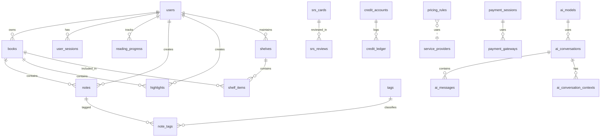

# 04_Database_Schema_and_Migration_Log.md

> **版本**：v1.0
> **来源**：基于 Alembic 迁移脚本反推的当前数据库状态。
> **定位**：数据库设计文档与数据字典。任何 Schema 变更必须先更新 Alembic 脚本，再同步此文档。

## 1. 数据库设计原则

*   **主键**：核心表全部使用 UUID (v4)。
*   **软删除**：核心表（如 `notes`, `tags`, `highlights`, `books`）包含 `deleted_at`（Timestamptz, Nullable）。
*   **审计**：所有表包含 `created_at`，大部分表包含 `updated_at`。
*   **安全**：敏感用户数据表（`notes`, `tags`, `highlights`）启用 RLS (Row Level Security)。
*   **扩展性**：广泛使用 `JSONB` 存储动态配置与元数据（如 `books.meta`, `system_settings.value`）。

## 2. 结构总览 (以 Alembic 为准)

以下表格已在生产环境存在：

*   **用户与基础**：`users`, `user_sessions`, `user_stats`, `invites`, `user_reading_goals`, `user_streaks`, `feature_flags`, `system_settings`, `translations`
*   **书籍与内容**：`books`, `shelves`, `shelf_items`, `conversion_jobs`, `tags`
*   **阅读与笔记**：`reading_progress`, `reading_sessions`, `reading_daily`, `notes`, `highlights`, `note_tags`, `highlight_tags`
*   **AI 与 SRS**：`ai_models`, `ai_conversations`, `ai_messages`, `ai_query_cache`, `ai_conversation_contexts`, `srs_cards`, `srs_reviews`
*   **计费与额度**：`credit_accounts`, `credit_ledger`, `credit_products`, `payment_sessions`, `payment_webhook_events`, `payment_gateways`, `pricing_rules`, `regional_prices`, `service_providers`, `free_quota_usage`
*   **其他服务**：`ocr_jobs`, `doc_events`, `doc_snapshots`, `doc_conflicts`, `doc_drafts`, `prompt_templates`

**[待迁移]** 以下表在代码或规划中提及，但尚未在迁移脚本中发现：
*   `vectors` (pgvector 存储表，目前可能使用了 `ai_query_cache` 或尚未创建专用表)

### 2.1 实体关系图 (ERD)



## 3. 数据字典 (Data Dictionary)

### 3.1 用户与认证 (User & Auth)

#### `users`
用户核心表。
*   `id` (UUID, PK)
*   `email` (TEXT, Unique, Lowercase)
*   `display_name` (TEXT)
*   `is_active` (BOOLEAN, Default: TRUE)
*   `membership_tier` (TEXT, Default: 'FREE')
*   `language` (TEXT, Default: 'zh-CN')
*   `timezone` (TEXT, Default: 'Asia/Shanghai')
*   `membership_expire_at` (TIMESTAMPTZ, Nullable)
*   `monthly_gift_reset_at` (TIMESTAMPTZ, Nullable)
*   `free_ocr_usage` (INTEGER, Default: 0)
*   `version` (INTEGER, Default: 1)
*   `updated_at` (TIMESTAMPTZ)

#### `user_sessions`
用户登录会话。
*   `id` (UUID, PK)
*   `user_id` (UUID, FK `users.id`)
*   `revoked` (BOOLEAN, Default: FALSE)
*   `created_at` (TIMESTAMPTZ)

#### `user_stats`
用户统计聚合表。
*   **Source**: Created in Migration `0111` (f1a2b3c4d5e6).
*   `user_id` (UUID, PK)
*   `invite_count` (INTEGER, Default: 0)
*   `extra_storage_quota` (BIGINT, Default: 0)
*   `extra_book_quota` (INTEGER, Default: 0)
*   `storage_used` (BIGINT, Default: 0)
*   `book_count` (INTEGER, Default: 0)
*   `updated_at` (TIMESTAMPTZ)

#### `invites`
邀请记录。
*   `id` (UUID, PK)
*   `inviter_id` (UUID)
*   `invite_code` (VARCHAR(20))
*   `status` (VARCHAR(20), Default: 'pending')
*   `invitee_id` (UUID, Nullable)
*   `completed_at` (TIMESTAMPTZ, Nullable)
*   `created_at` (TIMESTAMPTZ)

### 3.2 书籍与资产 (Books & Assets)

#### `books`
核心书籍表。
*   `id` (UUID, PK)
*   `user_id` (UUID)
*   `title` (TEXT)
*   `author` (TEXT, Nullable)
*   `language` (TEXT, Nullable)
*   `original_format` (TEXT, Nullable)
*   `minio_key` (TEXT)
*   `size` (BIGINT, Nullable)
*   `cover_image_key` (TEXT, Nullable)
*   `source_etag` (TEXT, Nullable)
*   `is_digitalized` (BOOLEAN, Nullable)
*   `initial_digitalization_confidence` (NUMERIC, Nullable)
*   `converted_epub_key` (TEXT, Nullable)
*   `digitalize_report_key` (TEXT, Nullable)
*   `meta` (JSONB, Default: '{}')
    *   `page_count` (int): 书籍页数
    *   `needs_manual` (bool): 是否需要人工介入
    *   `toc` (list): 目录结构 (Confirmed by usage)
        *   Schema: `[{ "title": "Chapter 1", "href": "ch1.html", "children": [...] }]`
    *   `cover_color` (string): 封面主色调 (Confirmed by usage)
    *   `is_scanned` (bool): 是否为扫描版 (Confirmed by usage)
    *   `dpi` (int): 扫描分辨率 (Confirmed by usage)
    *   `reflow_profile` (string): 重排参数 (Confirmed by usage)
    *   **Note**: 元数据字段 schema 未来将迁移到 OpenAPI 契约统一维护。
*   `version` (INTEGER, Default: 1)
*   `created_at` (TIMESTAMPTZ)
*   `updated_at` (TIMESTAMPTZ)

#### `shelves`
书架。
*   `id` (UUID, PK)
*   `user_id` (UUID)
*   `name` (TEXT)
*   `description` (TEXT, Nullable)
*   `version` (INTEGER, Default: 1)
*   `created_at` (TIMESTAMPTZ)
*   `updated_at` (TIMESTAMPTZ)

#### `shelf_items`
书架-书籍关联。
*   `shelf_id` (UUID, PK)
*   `book_id` (UUID, PK)
*   `position` (INTEGER, Nullable)
*   `created_at` (TIMESTAMPTZ)

#### `conversion_jobs`
书籍格式转换任务。
*   `id` (UUID, PK)
*   `user_id` (UUID) - (**Verified**: Defined as `user_id` in Alembic `0100`. If app code uses `owner_id`, it requires refactoring.)
*   `book_id` (UUID)
*   `source_key` (TEXT)
*   `target_format` (TEXT)
*   `output_key` (TEXT, Nullable)
*   `status` (TEXT, Default: 'pending')
*   `error` (TEXT, Nullable)
*   `created_at` (TIMESTAMPTZ)
*   `updated_at` (TIMESTAMPTZ)

### 3.3 笔记与高亮 (Notes & Highlights)

#### `notes`
用户笔记 (启用 RLS)。
*   `id` (UUID, PK)
*   `user_id` (UUID)
*   `book_id` (UUID)
*   `content` (TEXT)
*   `chapter` (TEXT, Nullable)
*   `location` (TEXT, Nullable)
*   `pos_offset` (INTEGER, Nullable)
*   `tsv` (TSVECTOR, Nullable) - 用于 Postgres 内置全文检索，当 OpenSearch 不可用时作为 fallback。
*   `version` (INTEGER, Default: 1)
*   `deleted_at` (TIMESTAMPTZ, Nullable)
*   `created_at` (TIMESTAMPTZ)
*   `updated_at` (TIMESTAMPTZ)

#### `highlights`
高亮 (启用 RLS)。
*   `id` (UUID, PK)
*   `user_id` (UUID)
*   `book_id` (UUID)
*   `start_location` (TEXT)
*   `end_location` (TEXT)
*   `color` (TEXT, Nullable)
*   `comment` (TEXT, Nullable)
*   `tsv` (TSVECTOR, Nullable) - 用于 Postgres 内置全文检索，当 OpenSearch 不可用时作为 fallback。
*   `version` (INTEGER, Default: 1)
*   `deleted_at` (TIMESTAMPTZ, Nullable)
*   `created_at` (TIMESTAMPTZ)
*   `updated_at` (TIMESTAMPTZ)

#### `tags`
标签系统 (启用 RLS)。
*   `id` (UUID, PK)
*   `user_id` (UUID)
*   `name` (TEXT)
*   `version` (INTEGER, Default: 1)
*   `deleted_at` (TIMESTAMPTZ, Nullable)
*   `created_at` (TIMESTAMPTZ)
*   `updated_at` (TIMESTAMPTZ)

#### `note_tags`
笔记-标签关联表 (Many-to-Many)。
*   `note_id` (UUID, PK, FK `notes.id`)
*   `tag_id` (UUID, PK, FK `tags.id`)
*   **Note**: 迁移脚本 `0106` 中尚未包含 `created_at`，建议在后续版本补充。

#### `highlight_tags`
高亮-标签关联表 (Many-to-Many)。
*   `highlight_id` (UUID, PK, FK `highlights.id`)
*   `tag_id` (UUID, PK, FK `tags.id`)
*   **Note**: 迁移脚本 `0106` 中尚未包含 `created_at`，建议在后续版本补充。

### 3.4 阅读进度 (Reading Progress)

#### `reading_sessions`
阅读会话记录。
*   `id` (UUID, PK)
*   `user_id` (UUID, FK)
*   `book_id` (UUID)
*   `device_id` (TEXT, Nullable)
*   `is_active` (BOOLEAN, Default: TRUE)
*   `total_ms` (BIGINT, Default: 0)
*   `last_heartbeat` (TIMESTAMPTZ, Default: now())

#### `reading_daily`
每日阅读统计。
*   `user_id` (UUID, PK)
*   `day` (DATE, PK)
*   `total_ms` (BIGINT, Default: 0)

#### `user_streaks`
用户阅读连续天数统计。
*   `user_id` (UUID, PK, FK `users.id`)
*   `current_streak` (INTEGER, Default: 0)
*   `longest_streak` (INTEGER, Default: 0)
*   `last_read_date` (DATE, Nullable)
*   `updated_at` (TIMESTAMPTZ)

#### `reading_progress`
每本书的阅读状态。
*   `user_id` (UUID, PK)
*   `book_id` (UUID, PK)
*   `progress` (NUMERIC, Default: 0)
*   `last_location` (JSONB, Nullable)
    *   (Schema 待定，通常包含 CFI 或页码信息)
*   `finished_at` (TIMESTAMPTZ, Nullable)
*   `updated_at` (TIMESTAMPTZ)

#### `user_reading_goals`
用户阅读目标。
*   `user_id` (UUID, PK, FK `users.id`)
*   `daily_minutes` (INTEGER, Default: 30)
*   `yearly_books` (INTEGER, Default: 10)
*   `updated_at` (TIMESTAMPTZ)

### 3.5 商业与计费 (Billing)

#### `credit_accounts`
用户积分账户。
*   `owner_id` (UUID, PK)
*   `balance` (BIGINT, Default: 0)
*   `currency` (TEXT, Nullable)
*   `wallet_amount` (NUMERIC, Default: 0)
*   `wallet_currency` (TEXT, Default: 'CNY')
*   `updated_at` (TIMESTAMPTZ)

#### `credit_ledger`
积分流水账。
*   `id` (UUID, PK)
*   `owner_id` (UUID)
*   `amount` (BIGINT)
*   `currency` (TEXT)
*   `reason` (TEXT, Nullable)
*   `related_id` (UUID, Nullable)
*   `direction` (TEXT)
*   `created_at` (TIMESTAMPTZ)

#### `credit_products`
积分充值商品。
*   `id` (UUID, PK)
*   `code` (TEXT, Unique)
*   `name` (TEXT)
*   `credits` (INTEGER)
*   `amount_minor` (INTEGER)
*   `currency` (TEXT, Default: 'CNY')
*   `updated_at` (TIMESTAMPTZ)

#### `payment_sessions`
支付会话。
*   `id` (UUID, PK)
*   `owner_id` (UUID)
*   `gateway` (TEXT)
*   `amount` (INTEGER)
*   `currency` (TEXT)
*   `status` (TEXT, Default: 'pending')
*   `return_url` (TEXT, Nullable)
*   `cancel_url` (TEXT, Nullable)
*   `external_id` (TEXT, Nullable)
*   `metadata` (JSONB, Nullable)
*   `created_at` (TIMESTAMPTZ)
*   `updated_at` (TIMESTAMPTZ)

#### `payment_webhook_events`
支付回调事件记录。
*   `id` (TEXT, PK)
*   `gateway` (TEXT)
*   `session_id` (UUID, Nullable)
*   `payload` (JSONB, Nullable)
*   `processed` (BOOLEAN, Default: FALSE)
*   `created_at` (TIMESTAMPTZ)
*   `updated_at` (TIMESTAMPTZ)

#### `payment_gateways`
支付网关配置。
*   `id` (UUID, PK)
*   `name` (TEXT, Unique)
*   `config` (JSONB)
*   `is_active` (BOOLEAN, Default: TRUE)
*   `version` (INTEGER, Default: 1)
*   `created_at` (TIMESTAMPTZ)
*   `updated_at` (TIMESTAMPTZ)

#### `pricing_rules`
定价规则。
*   `id` (UUID, PK)
*   `service_type` (VARCHAR(32))
*   `unit_type` (VARCHAR(32))
*   `unit_size` (INTEGER)
*   `price_amount` (NUMERIC(10,2))
*   `currency` (VARCHAR(10))
*   `region` (VARCHAR(10), Nullable)
*   `remark_template` (TEXT, Nullable)
*   `platform` (VARCHAR(20), Default: 'web')
*   `sku_id` (VARCHAR(100), Nullable)
*   `is_active` (BOOLEAN)
*   `version` (INTEGER)
*   `created_at` (TIMESTAMPTZ)
*   `updated_at` (TIMESTAMPTZ)

#### `regional_prices`
区域定价策略。
*   `id` (UUID, PK)
*   `plan_code` (VARCHAR(50))
*   `currency` (VARCHAR(10))
*   `period` (VARCHAR(20))
*   `amount_minor` (INTEGER)
*   `updated_at` (TIMESTAMPTZ)
*   `version` (INTEGER, Default: 1)

#### `service_providers`
第三方服务商配置。
*   `id` (UUID, PK)
*   `service_type` (TEXT)
*   `name` (TEXT)
*   `endpoint` (TEXT, Nullable)
*   `config` (JSONB, Default: '{}')
*   `is_active` (BOOLEAN, Default: TRUE)
*   `priority` (INTEGER, Default: 0)
*   `version` (INTEGER, Default: 1)
*   `updated_at` (TIMESTAMPTZ)

#### `free_quota_usage`
免费额度使用记录。
*   `owner_id` (UUID, PK)
*   `service_type` (TEXT, PK)
*   `period_start` (DATE, PK)
*   `used_units` (BIGINT, Default: 0)

### 3.6 AI 与向量 (AI & Vectors)

#### `ai_models`
AI 模型配置。
*   `id` (UUID, PK)
*   `provider` (TEXT)
*   `model_id` (TEXT, Unique)
*   `display_name` (TEXT)
*   `active` (BOOLEAN, Default: TRUE)
*   `updated_at` (TIMESTAMPTZ)

#### `ai_conversations`
AI 对话 Session。
*   `id` (UUID, PK)
*   `owner_id` (UUID)
*   `title` (TEXT)
*   `created_at` (TIMESTAMPTZ)

#### `ai_messages`
对话消息记录。
*   `id` (UUID, PK)
*   `conversation_id` (UUID, FK `ai_conversations.id`)
*   `owner_id` (UUID)
*   `role` (TEXT)
*   `content` (TEXT)
*   `created_at` (TIMESTAMPTZ)

#### `ai_conversation_contexts`
对话上下文关联。
*   `conversation_id` (UUID, PK, FK `ai_conversations.id`)
*   `owner_id` (UUID)
*   `mode` (TEXT, Nullable)
*   `book_ids` (JSONB, Nullable)
    *   Array of UUID strings: `["uuid1", "uuid2"]`
*   `updated_at` (TIMESTAMPTZ)

#### `ai_query_cache`
AI 响应缓存。
*   `owner_id` (UUID, PK)
*   `conversation_id` (UUID, Nullable)
*   `query_hash` (TEXT, PK)
*   `prompt` (TEXT, Nullable)
*   `response` (TEXT, Nullable)
*   `updated_at` (TIMESTAMPTZ)

#### `srs_cards`
间隔复习卡片。
*   `id` (UUID, PK)
*   `owner_id` (UUID)
*   `highlight_id` (UUID, Unique)
*   `question` (TEXT)
*   `answer` (TEXT)
*   `created_at` (TIMESTAMPTZ)
*   `updated_at` (TIMESTAMPTZ)

#### `srs_reviews`
复习记录。
*   `id` (UUID, PK)
*   `owner_id` (UUID)
*   `card_id` (UUID, FK `srs_cards.id`)
*   `ease_factor` (NUMERIC, Default: 2.5)
*   `repetitions` (INTEGER, Default: 0)
*   `interval_days` (INTEGER, Default: 1)
*   `last_grade` (INTEGER, Nullable)
*   `next_review_at` (TIMESTAMPTZ, Nullable)
*   `updated_at` (TIMESTAMPTZ)

#### `vectors` (Future Plan / Not Implemented)
*   **Status**: [待迁移]
*   **Description**: 计划引入的 pgvector 向量索引表，用于替代 `ai_query_cache` 的部分功能并支持全文向量检索。
*   **Note**: 当前系统可能使用 `ai_query_cache` 或内存向量库，此表尚未实装。
*   **Proposed Schema**: `embedding_id`, `owner_id`, `content_type`, `content_id`, `embedding vector(1536)`.

### 3.7 文档协作 (Realtime Docs)

#### `doc_events`
文档编辑事件日志。
*   `id` (UUID, PK)
*   `doc_id` (TEXT)
*   `content` (TEXT)
*   `created_at` (TIMESTAMPTZ)
*   **Note**: 当前实现仅为基础日志。未来版本计划增加 `version` (int), `actor_id` (uuid), `ops` (jsonb), `is_conflict` (bool) 以支持完整 CRDT/OT 协作。

#### `doc_snapshots`
文档快照。
*   `id` (UUID, PK)
*   `doc_id` (TEXT)
*   `snapshot` (TEXT)
*   `created_at` (TIMESTAMPTZ)

#### `doc_conflicts`
编辑冲突记录。
*   `id` (UUID, PK)
*   `doc_id` (TEXT)
*   `base_version` (INTEGER)
*   `actual_version` (INTEGER)
*   `created_at` (TIMESTAMPTZ)

#### `doc_drafts`
文档草稿。
*   `id` (UUID, PK)
*   `doc_id` (TEXT)
*   `snapshot` (TEXT)
*   `created_at` (TIMESTAMPTZ)

### 3.8 其他服务与系统 (Other Services & System)

#### `ocr_jobs`
OCR 识别任务。
*   `id` (UUID, PK)
*   `user_id` (UUID) - (Added in 0109)
*   `owner_id` (UUID) - (Legacy field from 0100)
*   `book_id` (UUID, Nullable) - (Added in 0109)
*   `source_key` (TEXT)
*   `status` (TEXT, Default: 'uploading')
*   `result_text` (TEXT, Nullable)
*   `error` (TEXT, Nullable)
*   `page_count` (INTEGER, Default: 0) - (Added in 0109)
*   `deduction_strategy` (VARCHAR(50), Nullable) - (Added in 0109)
*   `deduction_amount` (INTEGER, Default: 0) - (Added in 0109)
*   `created_at` (TIMESTAMPTZ)
*   `updated_at` (TIMESTAMPTZ)

#### `prompt_templates`
AI 提示词模板。
*   `id` (UUID, PK)
*   `name` (TEXT, Unique)
*   `content` (TEXT)
*   `updated_at` (TIMESTAMPTZ)
*   **Note**: 迁移脚本 `0103` 中尚未包含 `variables`, `version`, `description`，建议在后续版本补充。

#### `system_settings`
系统全局配置。
*   `id` (UUID, PK)
*   `key` (TEXT, Unique)
*   `value` (JSONB)
*   `updated_at` (TIMESTAMPTZ)

#### `feature_flags`
功能特性开关。
*   `id` (UUID, PK)
*   `key` (TEXT, Unique)
*   `is_enabled` (BOOLEAN, Default: FALSE)
*   `updated_at` (TIMESTAMPTZ)

#### `translations`
多语言翻译资源。
*   `id` (UUID, PK)
*   `namespace` (TEXT)
*   `key` (TEXT)
*   `lang` (TEXT)
*   `value` (JSONB)
*   `deleted_at` (TIMESTAMPTZ, Nullable)
*   `version` (INTEGER, Default: 1)
*   `updated_at` (TIMESTAMPTZ)
*   Constraint: `UNIQUE(namespace, key, lang)`

## 4. RLS 策略详解 (Row Level Security)

当前仅以下表启用了 RLS，策略均为 **Owner Isolation**：

1.  **Notes** (`notes`)
2.  **Tags** (`tags`)
3.  **Highlights** (`highlights`)

**策略逻辑**：
```sql
USING (
  user_id = current_setting('app.user_id')::uuid 
  OR current_setting('app.role', true) = 'admin'
)
WITH CHECK (
  user_id = current_setting('app.user_id')::uuid 
  OR current_setting('app.role', true) = 'admin'
)
```
*   **读取/修改**：仅允许 `user_id` 匹配当前 Session 变量 `app.user_id` 的行。
*   **例外**：如果 Session 变量 `app.role` 为 `admin`，则拥有完全访问权限。
*   **依赖**：应用层必须在连接 PgBouncer 后、执行查询前，执行 `SET app.user_id = '...'`。
*   **警告**：必须确保在 PgBouncer (transaction pooling) 环境下，通过 `SET LOCAL app.user_id` 完成用户隔离。禁止匿名访问，否则 query 会被错误共享，造成严重越权问题。

**未来扩展计划**：
*   **书籍共享模式**：计划引入 `book_shares` 表，支持多用户对同一书籍的只读或协作权限。届时 RLS 策略需升级为 `user_id = current_user OR EXISTS (SELECT 1 FROM book_shares WHERE book_id = ...)`。
*   **团队/组织隔离**：引入 `organization_id`，支持 B 端租户隔离。

## 5. 索引优化 (Indexes)

核心业务索引（自动创建）：

*   **唯一性约束**：
    *   `books(user_id, source_etag)` -> `uniq_books_user_etag`
    *   `tags(user_id, name)` (Partial: `WHERE deleted_at IS NULL`) -> `uniq_tags_user_name_active`
    *   `srs_cards(highlight_id)`
    *   `invites(invite_code)` -> `ix_invites_code`
    *   `regional_prices(plan_code, currency, period)` -> `ix_regional_prices_uniq`
*   **性能优化**：
    *   `shelves(user_id, updated_at DESC)` -> `idx_shelves_user_updated`
    *   `books(user_id, updated_at DESC)`
    *   `notes(user_id, updated_at DESC)` -> `idx_notes_user_updated`
    *   `highlights(user_id, updated_at DESC)` -> `idx_highlights_user_updated`
    *   `reading_sessions(user_id, last_heartbeat DESC)` -> `idx_reading_sessions_user`
    *   `reading_progress(user_id, updated_at DESC)` -> `idx_reading_progress_user`
    *   `reading_progress(user_id, finished_at)` -> `idx_reading_progress_user_finished`
    *   `conversion_jobs(user_id, status, created_at DESC)`
    *   `credit_ledger(owner_id, created_at DESC)`
*   **全文检索/JSONB**：
    *   `books((meta->>'page_count'))` -> `idx_books_meta_page`
    *   `notes USING GIN(tsv)` -> `idx_notes_tsv`
    *   `highlights USING GIN(tsv)` -> `idx_highlights_tsv`

## 6. Alembic 迁移日志 (Migration Log)

| Revision ID | Date | Description |
| :--- | :--- | :--- |
| `0114` | 2025-11-27 | Lowercase users email |
| `g2b3c4d5e6f7` (0113) | 2025-11-27 | Fix user_stats (add storage/book count) |
| `0112abcdef01` (0112) | 2025-11-26 | Add reading stats (goals, streaks, finished_at) |
| `f1a2b3c4d5e6` (0111) | 2025-11-23 | Add missing tables (invites, user_stats, regional_prices) |
| `e2b7c3d4e5f6` (0110) | 2025-11-23 | Add users V9.1 columns (expire, gift, free_ocr) |
| `d0a6b2c4e5f7` (0109) | 2025-11-23 | Add OCR V9.1 columns |
| `c9f5a1b4d3e6` (0108) | 2025-11-23 | Add pricing platform & SKU |
| `b8e4f0c3d2a5` (0107) | 2025-11-23 | Adjust tags unique index (handle soft delete) |
| `a7f3e9b2c1d4` (0106) | 2025-11-23 | Add books.meta, notes, tags, highlights, RLS |
| `0105_ai_srs` | 2025-11-19 | Add AI, SRS, Credit Products, Users Locale |
| `0104_add_analysis` | 2025-11-19 | Add books analysis columns |
| `0103_runtime` | 2025-11-19 | Add runtime tables (users, reading, docs, etc.) |
| `0102_ext_id` | 2025-11-17 | Add external_id to payment_sessions |
| `0101_etag` | 2025-11-16 | Add books source_etag |
| `0100_squash` | 2025-11-16 | Squash baseline (Core tables) |

## 7. 逻辑分层与命名规范 (Logical Domains & Naming Conventions)

### 7.1 领域逻辑划分
为辅助 AI 代码生成与理解，数据库表按以下领域逻辑划分：

*   **User Domain**: `users`, `user_sessions`, `user_stats`, `invites`, `user_reading_goals`, `user_streaks`
*   **Book Domain**: `books`, `shelves`, `shelf_items`, `conversion_jobs`
*   **Notes Domain**: `notes`, `highlights`, `tags`, `note_tags`, `highlight_tags`
*   **Reading Domain**: `reading_progress`, `reading_sessions`, `reading_daily`
*   **Billing Domain**: `credit_accounts`, `credit_ledger`, `credit_products`, `payment_*`, `pricing_rules`
*   **AI Domain**: `ai_*`, `srs_*`, `vectors`
*   **Realtime Docs Domain**: `doc_*`
*   **System Domain**: `system_settings`, `feature_flags`, `translations`, `audit_logs`

### 7.2 表命名规范
*   **Case**: 全部小写 (lowercase)，使用下划线分隔 (snake_case)。
*   **Pluralization**: 表名使用复数 (e.g., `users`, `books`)，关联表使用动词或组合名 (e.g., `user_sessions`, `shelf_items`)。
*   **Primary Key**: 统一命名为 `id`，类型为 `UUID`。
*   **Timestamps**: 所有表必须包含 `created_at`，大部分表包含 `updated_at` (TIMESTAMPTZ)。
*   **Foreign Keys**: 使用 `singular_table_name_id` (e.g., `user_id`, `book_id`)。
*   **Boolean**: 使用 `is_` 或 `has_` 前缀 (e.g., `is_active`, `is_digitalized`)，或状态形容词 (e.g., `processed`, `revoked`)。


建议后端工程师根据文档中的 Verified 警告，检查 api/app/books.py 中关于 conversion_jobs 的查询代码，尽快将 owner_id 统一重构为 user_id ，以消除隐患。
